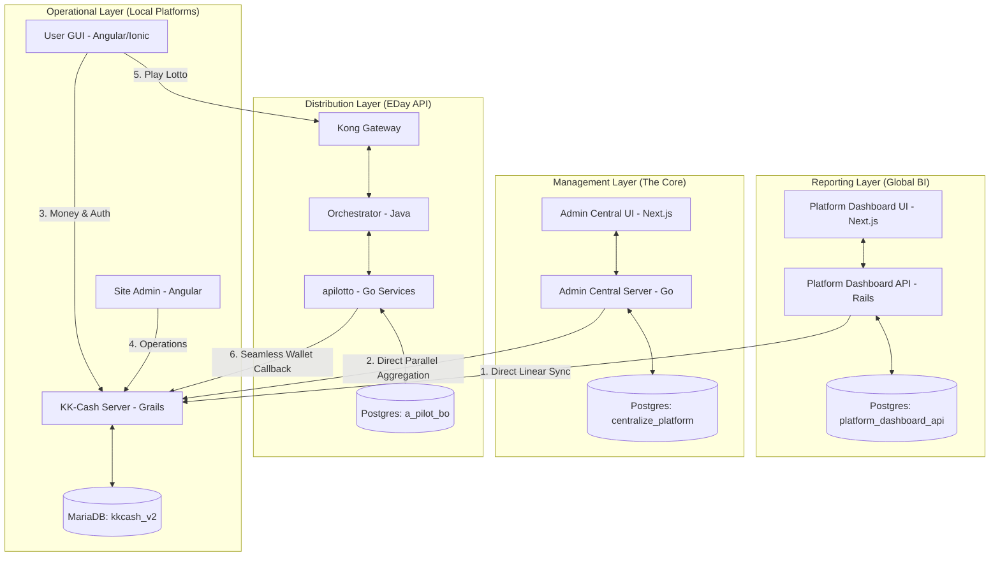

# RBTH Ecosystem Connectivity

## 🗺️ High-Level Map (Current Implementation)
The RBTH ecosystem is a **Federated Tiered Architecture** using isolated data stores for each functional layer to ensure security and scalability.

---

## 🏗️ Data Storage Isolation

| Layer | Primary Service | Logical Database | Technology | Role |
| :--- | :--- | :--- | :--- | :--- |
| **Reporting** | `platform-dashboard-api` | **`platform_dashboard_api`** | PostgreSQL | Historical snapshots and BI metrics. |
| **Management**| `admin-central-server` | **`centralize_platform`** | PostgreSQL | Partner config, invoices, and global blacklist. |
| **Distribution**| `apilotto-*` suite | **`a_pilot_bo`** | PostgreSQL | BO user accounts and game engine config. |
| **Operation** | `kk-cash-server` | **`kkcash_v2`** | MariaDB | Real-time transactions and player wallets. |

---

## 🏗️ Functional Layers

### 1. Reporting Layer (Global BI)
- **Repo:** `centralize/platform-dashboard-api` (Rails) + `platform-dashboard` (Next.js)
- **Connection:** **Isolated Path.** It pulls data from platforms and saves it into its own dedicated `platform_dashboard_api` database. It does not share tables with any other service.

### 2. Management Layer (The Core)
- **Repo:** `centralize/admin-central-server` (Go) + `admin-central-server-ui` (Next.js)
- **Connection:** This is the administrative hub. It maintains its own state in the `centralize_platform` database and provides real-time views by proxying requests to operational platforms.

### 3. Distribution Layer (EDay API / B2B)
- **Repo:** `API/apilotto-*` (Go) + `API/orchestrator-service` (Java)
- **Connection:** Secured by **Kong Gateway**. Manages the B2B lottery logic and partner integrations using the `a_pilot_bo` database for system-wide configuration.

### 4. Operational Layer (Local Platforms)
- **Repo:** `cash/kk-cash-server` (Grails)
- **Connection:** Independent MariaDB instances (e.g., `kkcash_v2`). This is where the actual financial "Source of Truth" lives for each site.

---

## 💡 Architectural Summary
The system ensures high availability and security by isolating data. Even though multiple services might run on the same PostgreSQL host, they are separated into **logical database instances**. This prevents a failure or security breach in the Reporting Layer from affecting the critical Management or Operational layers.

## References
- `wiki/concepts/platform-dashboard-api-workflow.md`
- `wiki/concepts/admin-central-aggregation-workflow.md`
- `wiki/concepts/kong-gateway-microservices.md`
- `wiki/concepts/seamless-wallet-flow.md`
